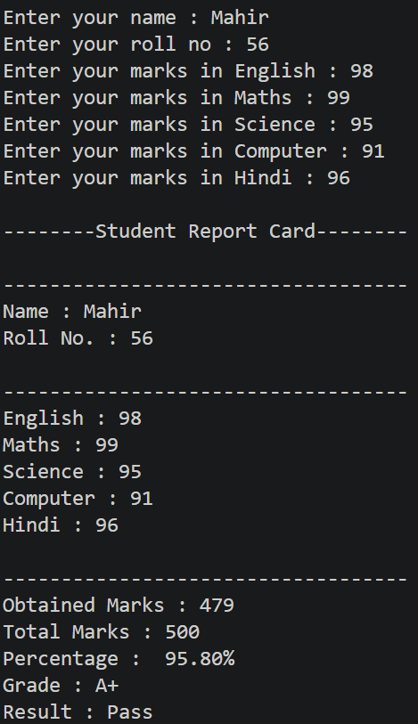

# Student---Report---Card
A python project to generate student report card with percentage , grade and result calculation.
Features:
- Takes student details and marks
- Calculates total marks
- Calculates percentage
- Assigns grade
- Shows Pass/Fail result

Concepts Used:
- Python Input/Output
- Variables
- Conditional Statements
- Arithmetic Operators
## Output

